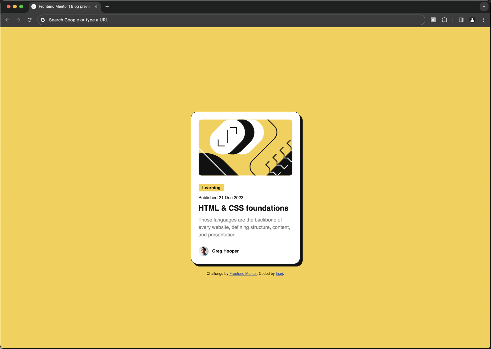
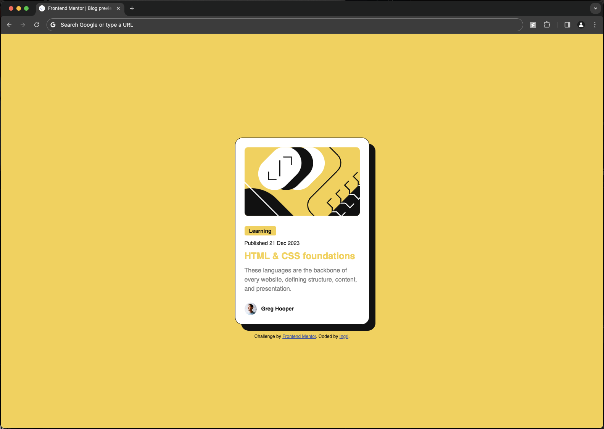

# Frontend Mentor - Blog preview card

This is a solution to the [Blog preview card coding challenge](./design/desktop-preview.jpg). [Frontend Mentor](https://www.frontendmentor.io) challenges help you improve your coding skills by building realistic projects.

## Table of contents

- [Overview](#overview)
  - [Screenshot](#screenshot)
  - [Links](#links)
- [My process](#my-process)
  - [Built with](#built-with)

## Overview

### Screenshot

### Links

- Solution URL: [Add solution URL here](https://github.com/ingri-e/blog-preview-card)
- Live Site URL: [Add live site URL here](https://ingri-e.github.io/blog-preview-card/)

## My process

### Built with

- Semantic HTML5 markup
- CSS Grid
- Following Figma file specs

# Frontend Mentor -
